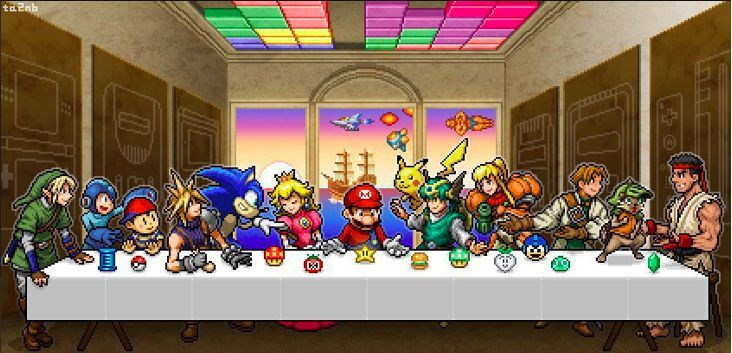

> - 关于游戏也许大多人对它的第一印象是玩物丧志，沉迷，但是娱乐也是生活中不可或缺的一部分。毕竟游戏不只是电子类。
> - 一件事物本没有好坏之分只是用它做了不同的用途成就了不一样的结局而已。游戏带来了什么。玩游戏会让你开心吗？会的话那恭喜你。是你在玩游戏。不是游戏在玩你。

:::warning 观前提醒
仅个人想法

:::

<!-- truncate -->

### 
游戏？什么游戏

    从小到大关于游戏听到的最多的一句话就是----玩游戏有什么用？
    在现在的时代很多人可以回答玩游戏可以打电竞，做直播，可以挣很多钱，但对我个人而言，我打游戏不是为了这个，从来不是。

&emsp;&emsp; <big><strong>记</strong></big>得我第一次接触游戏是通过小霸王游戏机，通过它我打开了通往游戏世界的大门，那时总会和儿时的朋友聚在一起，拿着爷爷买来的手柄和游戏卡，有时候一打就是一下午甚至一天，也通关了不少游戏，什么影子传说、赤色要塞、松鼠大作战等等。（提到游戏卡，我一直不理解用白酒擦拭金手指的方法是怎么做到全国统一的），后来家里有了第一台电脑，我也接触到了到现在我也一直喜欢的类型，fps 游戏 CS1.6，以及 Moba 游戏 Dota，不过貌似自那以后起，都变成了我一个人打游戏（也有家里电脑没联网的原因），小时候的朋友也都不再联系，这时候已经是初中的时间了，如果说为什么那段时间对游戏这么狂热，也许也有点叛逆心理，家里人不让玩，自己就越想玩。再后来到了高中，我清晰的记得我第一次去网吧的事：那是高二，中午下了雪，路上结了冰，所以没法回家，于是被朋友的怂恿下带到了网吧，那是一个离学校不远的小网吧（1.5 元/h 来着），然后我第一次接触了英雄联盟，玩的第一个英雄是塞恩。接着就控制不住，高中期间也没少去网吧。再后来又到了大学的时候，接触到 Steam 也算是打开了我整个游戏世界观，我在 Steam 买的第一款游戏是 Titan Souls，因为室友说这游戏很难，不过我恰巧喜欢比较吃操作的，也许是小时候玩了太多游戏的加持，对这种小游戏很容易上手，值得一提的是 Titan Souls 两个多小时我就通关了（虽然有几个 Boss 没打），后来又通关了古墓丽影，空洞骑士，奥日与萤火意志，泰坦陨落，蔚蓝等等太多太多了，每通关一款游戏，我多少也会失落，不过我也会期待下一次新的游戏挑战。大学期间开黑是最快乐的了，只要是能联机的，不管多少钱，什么渠道，都会想尽办法开黑，最让我记忆犹新的是和朋友一起玩双人成行了，说实话，那段时间两个人一起闯关一起通关，仿佛又回到了童年一样。其中有段时间我还比较痴迷于老游戏，甚至在中途还会为自己小时候没玩过感到遗憾。
后来随着年龄增长，一个人打游戏的次数也慢慢减少了，因为我觉得一个人打着实没什么意思，我也慢慢理解了**游戏的最高配置是朋友**这句话，也庆幸我有几个一起玩游戏的朋友。

传统式教育带来的想法只是你能不能挣更多的钱，没有人在乎你真正过的好不好。要说游戏给我现在带来了什么？游戏并没有给我带来什么实质性的东西，与其说游戏带给了我快乐，不如说游戏填补了我的孤独而已。如果十几年前的我见到现在的我，大概他只会为我变得无趣而难过。

我也可以假设我们现在的世界也是一个游戏，我享受游戏阶段通关后的成就感，享受游戏过程中的紧张感，我来到这里的目的就是体验，失去与获得，痛苦与喜乐，这都是体验的一部分，对我个人而言，我还没有看够风景，这世间还有太多我所好奇的东西，还有太多我想去追逐的东西，就好比游戏还有很多副本没有打，我还要继续玩下去。

玩游戏，然后评测、分享、交流、吐槽，也许这就是我理想的游戏人生。
