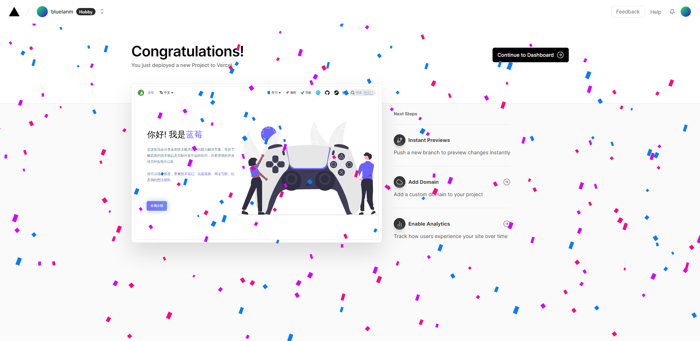
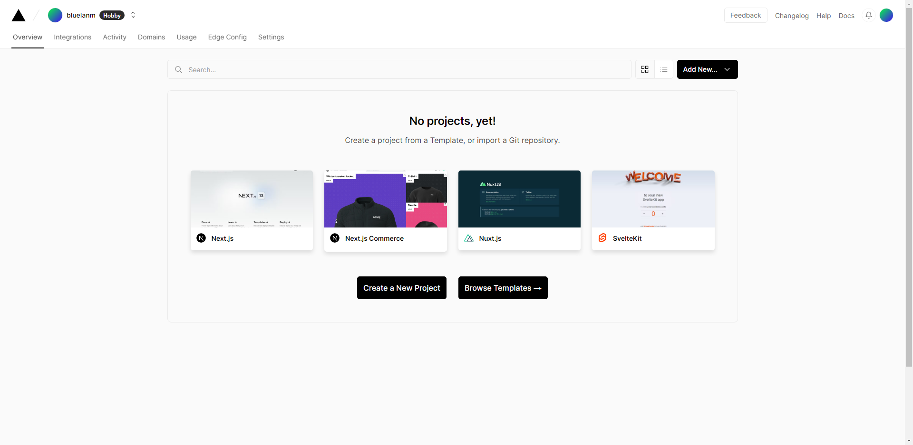
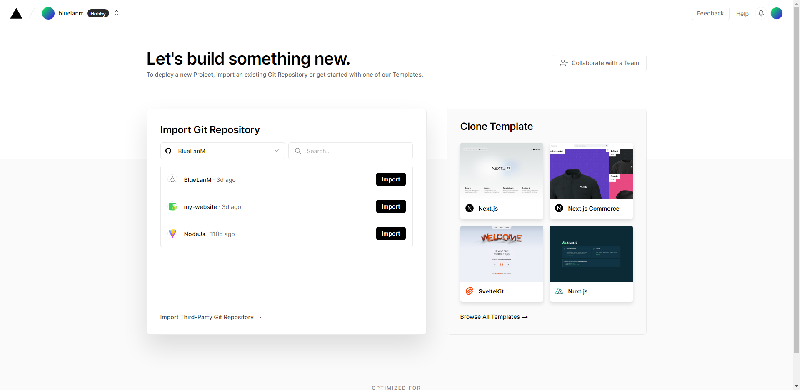
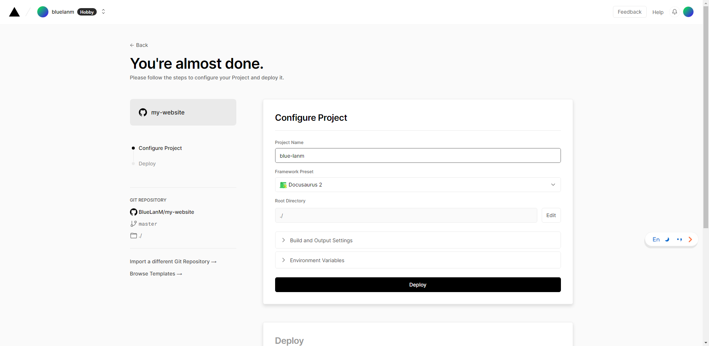
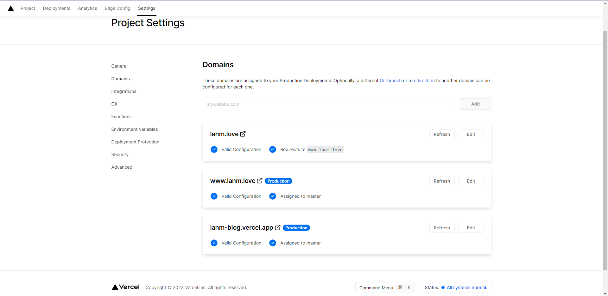
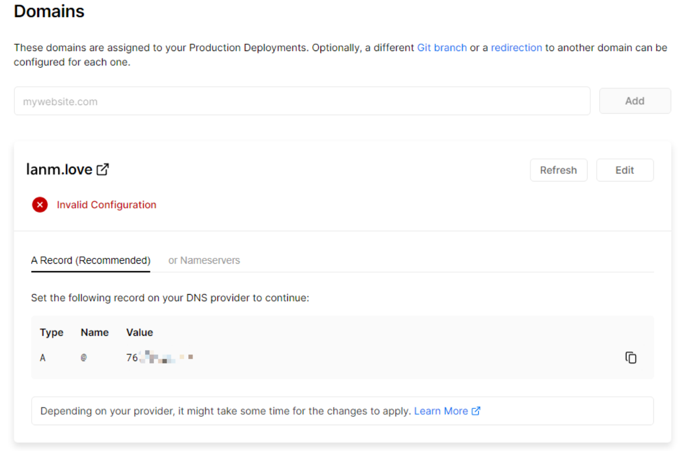
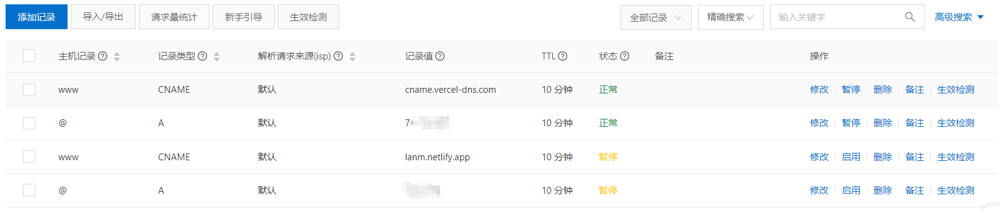
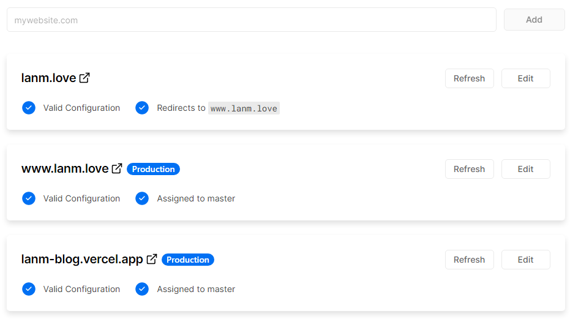
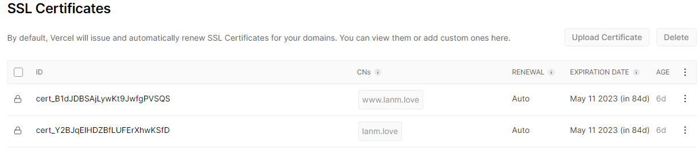

:::tip 观前提醒

[Vercel](https://vercel.com/) 部署静态资源网站极其**简单方便**，并且有可观的**访问速度**，最主要的是**免费部署**。

但是由于某些原因，vercel.app 被墙，目前在国内已经无法打开，除非你有自己的域名，通过 **CNAME** 解析访问你的域名。

或者如果没有域名且想要在国内访问，推荐 [Netlify](https://app.netlify.com/)

:::

<!-- truncate -->

## Vercel

[vercel 介绍](https://zhuanlan.zhihu.com/p/452654619?utm_id=0)

## 登录账号

首先去[Vercel](https://vercel.com/)官网登录账号，最好用 Github 登录，没有的话注册一个。

## 部署网站

进入 [Dashboard](https://vercel.com/dashboard)

点击 [Create a New Project](https://vercel.com/new)

此时会显示你的 Github 中的 repository，选中要导入库旁边的 Import。

点击 Deploy，然后静等网站安装依赖以及部署，稍后将会出现下方页面。

此时网站已经成功搭建完毕了，点击图片即可跳转到 Vercel 所提供的二级域名访问。

## 自定义域名

如果你有自己的域名，可以在 Setting --> Domains 添加域名。

接着提示域名需要 DNS 解析到 vercel 提供的记录值

去到你的域名所在的服务商，根据 Vercel 提供的记录值 cname.vercel-dns.com，添加两条记录（netlify 同理）

此时回到 Vercel，可以看到记录值成功生效。

此时访问自己的域名，可以访问到页面，并且访问速度也正常。

## 自动颁发 SSL 证书

默认状态下，Vercel 将会颁发并自动更新 SSL 证书。（非常方便，不用自己手动去申请证书，配置证书）

## 持续集成（CI）/持续部署（CD）

当主分支有代码被推送，Vercel 将会重新拉取代码，并重新构建进行部署。

## 总结

由此可见 Vercel 直接可以上手使用，并不需要过多的配置。
