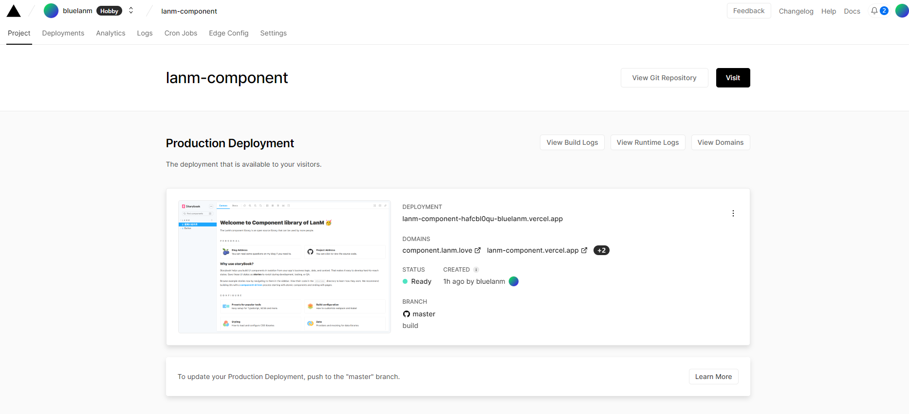
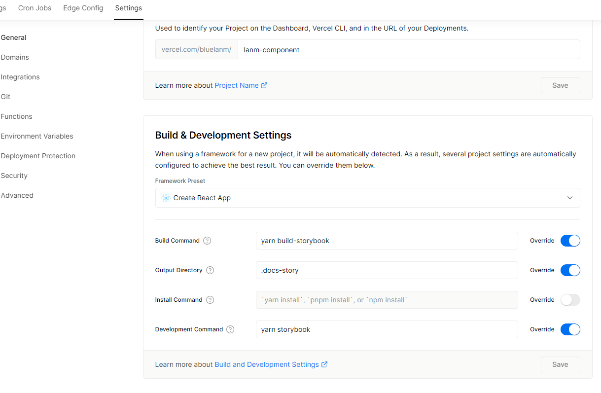
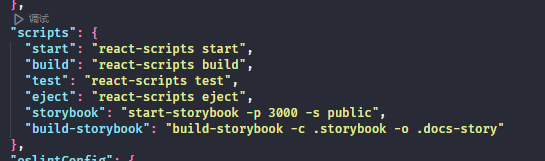

&emsp;&emsp;今天在部署我个人的组件库的时候遇到了一个问题，那就是部署的时候提示找不到打好的包，经过一顿抓耳挠腮可算是解决了。出现这个问题原因是因为我开发组件库用的 storybook 这个开发环境，导致 Vercel 打包的时候运行的 yarn build 是 create-react-app 环境的 package.json 中的 build，而 storybook 特殊在运行环境是独立的 yarn storybook，同理，build 也是 build-storybook，所以即使打包时没有提示错误的话，如果不修改配置项，显示的主页是 main.jsx 里的内容。其实解决办法很简单，在此记录下。

<!-- truncate -->

### 首先打开 Vercel 项目

### 找到 Setting 里的 Build&Development Settings

### 在此处配置你在部署时对应运行的命令

解释一下，此处的 ** -o .docs-story ** 的意思是，在打包时创建名为 docs-story 的文件夹，并将打包好的静态资源全部存入这个文件夹中

### 接下来重新 deploy 就好了
