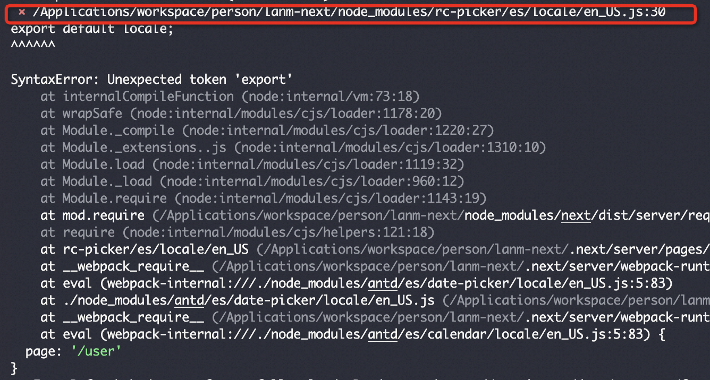

今天准备用 Nextjs 写项目的，本能的想用 antd，但是在安装好使用时突然报了一个错误

> SyntaxError: Cannot use import statement outside a module

<!-- truncate -->

提示说是**无法在模块外部使用 import 语句**

好吧，我也不太懂，google 一下发现这是 antd 库里的问题，在我心灰意冷的准备用 mui 组件库的是时候，发现 issue 有个老哥给出了解决方案，试了一下
果然解决了。

在报错信息的上方有一条错误指向的模块。例如：



可以看到有个**rc-picker**模块是问题的所在，只需在 next.config.js 中添加**transpilePackages**就可以了

每加一个就会有不同的模块，挨个加进去就好了。

```jsx
const nextConfig = {
  reactStrictMode: true,
  transpilePackages: [
    "rc-util",
    "antd",
    "@ant-design",
    "rc-pagination",
    "rc-picker",
  ],
};
```
