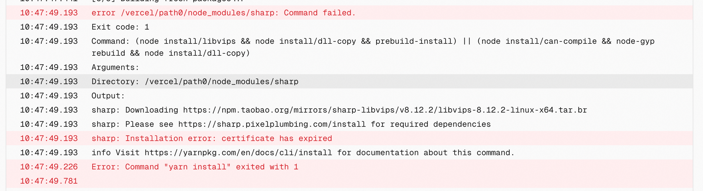
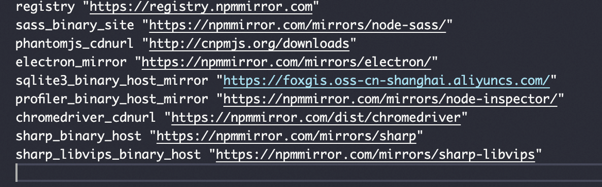

今天照常写完 blog 发布时突然遇到了下面这个问题，查了查**Installation error: certificate has expired`**大概含义是证书过期的意思。

<!-- truncate -->

摸索半天最后发现是 npm 镜像源的问题，原淘宝镜像源 http://npm.taobao.org 已过期了，需要替换成 https://registry.npmmirror.com

而我用的 yarn 所以需要在 .yarnrc 文件里改一下

