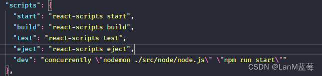

**为什么要设置一键启动呢？**

前端代码和 node 代码是分离的，node 代码执行每次需要单独执行 nodemon 来启动，但是我也遇到了问题，在 nodemon 启动后，如果在一段时间内没有对数据库进行操作，连接会自动断开，这时就需要重新执行 nodemon，而在网上查阅的相关资料都没有解决，于是想到了让前端和 node 同时启动的办法，既方便也解决了连接断开的问题。

<!-- truncate -->

### 一键启动 node 项目和前端项目

关键在于 concurrently

```jsx
npm i concurrently
```

在 package.json 里直接加入：
注意此处 nodemon 执行的是你存放 node 代码的地址

```jsx
"dev": "concurrently \"nodemon ./src/node/node.js\" \"npm run start\""
```


