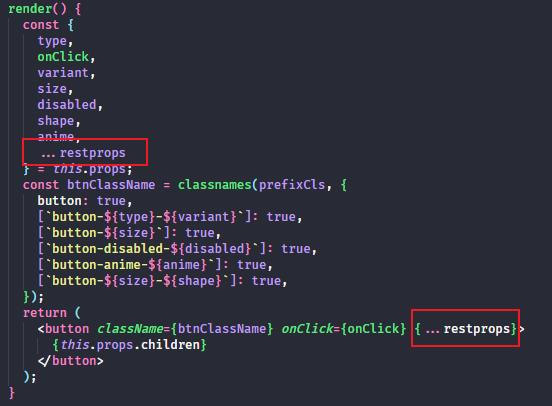

#### 今天在封装 Button 组件的时候，我发现我自己封装的组件用不了 style 和 className 属性的问题。

<!-- truncate -->

## 解决办法

可以使我们自己的接口来继承原生 button 的接口

```jsx
<ButtonHTMLAttributes<HTMLElement> //原生 button
```

```jsx
export interface ButtonProps extends <ButtonHTMLAttributes<HTMLElement>> {
}
```

但会遇到 接口 **ButtonProps 错误扩展接口 ButtonHTMLAttributes**的问题。

这是因为自己封装的接口里有一些属性和原生 button 冲突了，例如 ' type '，' disabled ' 等等。

这就要用到 ts 里的 Omit，从类型中剔除一些属性。

剔除一个属性：

```jsx

Omit< React.InputHTMLAttributes<HTMLInputElement>, 'type'>
```

剔除多个属性：

```jsx
Omit<ButtonHTMLAttributes<HTMLElement>, "type" | "disabled">
```

```jsx
export interface ButtonProps
  extends Omit<ButtonHTMLAttributes<HTMLElement>, "type" | "disabled"> {
  type?: ButtonType;
  variant?: ButtonStyle;
  size?: ButtonSize | string;
  children?: string;
  disabled?: Boolean;
  anime?: Boolean;
  shape?: ButtonShape;
  onClick?: () => void;
}
```

解决完接口的问题后，还需要在原生的 button 上加上属性



当然，Input 之类的也是同理，这样就大功告成了。

也欢迎访问我的组件库！蓝莓组件库 😆
