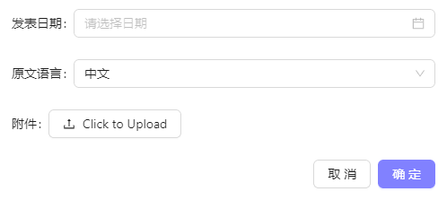
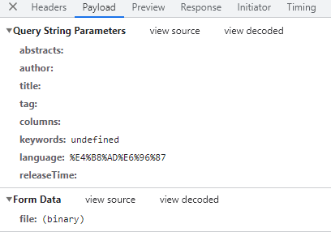
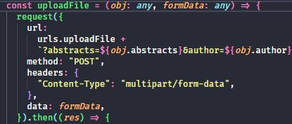
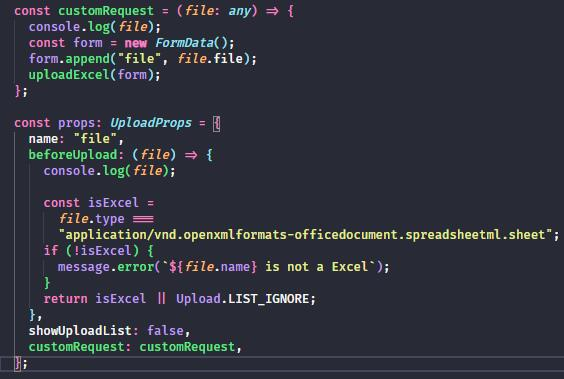
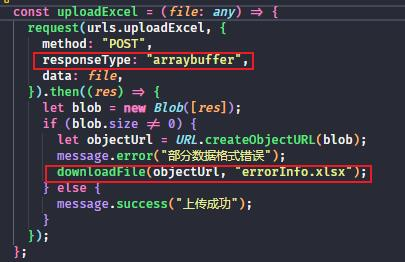
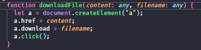
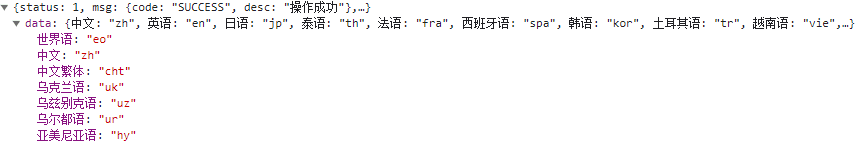

记录一下调接口时遇到过的一些问题。

<!-- truncate -->

### 上传文件时，不止上传文件，还要有对象

比如这种情况 

而需要传递的参数却是这种的 

只是处理文件的话只需要 new FormData() 就可以了，传递对象的话只能用拼接字符串的方法来实现了。

比如 

### 上传 Excel 文件时，如果格式有错误，下载错误信息的 Excel

用的是 Antd Upload 的组件

这个接口在格式有错误的情况下并不会报错，因为如果一个表格中有 4 条数据，但只有 1 条是错误的，另外 3 条依旧是会上传成功的。

所以这个错误信息是后端返回过来的文件流，如果没有就不会返回。

在 Upload 的组件中，如果使用默认 action 的方法调用接口，是不能实现的，其中有一个 customRequest 方法可以实现自定义请求上传。

比如 

此处我是根据有没有返回文件流来判断有没有出错的



注意此处的 **request-type:'arraybuffer'** 是必须的



### Antd 的 Select 组件，后端返回的 option 不是数组

例如后端返回的格式是：

所以需要转换一下：

```jsx
let arr = Object.keys(Data); //Data就是数据对象
let val = Object.values(Data);

let array = arr.map((item: any, index: any) => {
  return { label: item, value: val[index] };
});
```
