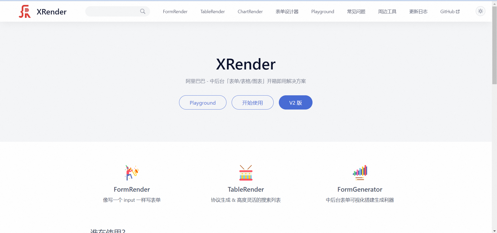

入职到现在，目前接触到了一个万能表格组件----XRender，其中分为 FormRender、TableRender 以及 ChartRender

<!-- truncate -->

目前用到最多的是 FormRender，他与 Antd 的最大区别是不需要内部用 Form-Item 包裹，相较于 Form 更容易工程化代码，所有的 Form 表单控制内部元素都在 schema 里就能实现，还是很容易上手的。
