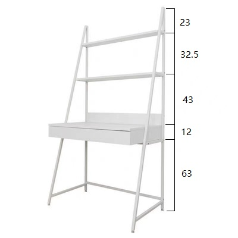

## 😆

在 2023 年 5 月 15 日 我终于实现了多年的梦想，那就是给自己配一台高配置的电脑主机，鸡冻的心情久久不能平静~~

不过作为小白的我，最终还是没能下定自己 DIY 主机的决心。

晒一下配件：

|             名称             |                     硬件                     | 价格/￥ |
| :--------------------------: | :------------------------------------------: | :-----: |
| &nbsp;&nbsp;CPU&nbsp;&nbsp;  |                 AMD R5 7600                  |  1230   |
| &nbsp;&nbsp;散热&nbsp;&nbsp; |                追风者伯乐 S4                 |   65    |
| &nbsp;&nbsp;主板&nbsp;&nbsp; |             微星 B650M 迫击炮 D5             |  1480   |
| &nbsp;&nbsp;内存&nbsp;&nbsp; |        阿斯加特 TUF 联名 DDR5 16G\*2         |   600   |
| &nbsp;&nbsp;固态&nbsp;&nbsp; | 宏碁 GM7 PCIE4.0 1TB / 梵想 S790 PCIE4.0 2TB |   380   |
| &nbsp;&nbsp;显卡&nbsp;&nbsp; |     讯景 AMD 6950XT 海外版 PRO 16G 显存      |  4400   |
| &nbsp;&nbsp;机箱&nbsp;&nbsp; |              华硕 AP201 冰立方               |   390   |
| &nbsp;&nbsp;电源&nbsp;&nbsp; |                九州风神 DQ850                |   466   |
| &nbsp;&nbsp;总计&nbsp;&nbsp; |                     ---                      |  9011   |

虽然下单时很痛苦，不过仔细想想这最起码也可以用几年了，值了！😋

<!-- truncate -->

## 关于配件方面的一些总结

### 显卡

说实话之前对 AMD 的显卡不是很了解，一直以为在打游戏方面是不如 NVIDIA 的，不过在朋友的推荐下以及看了很多 AMD 之类的评测后，也改变了我这种想法，不过有一点是确认的，在生产力方面以及光追方面，AMD 确实不如英伟达，不过我就是个普通游戏玩家，追求并不是那么高，况且价格方面也算说得过去。6950XT 也是上一代的 AMD 旗舰卡了，如果说 6950XT 在游戏性能方面对标 NVIDIA 的话，那就是 3090ti 了。不过唯一有些顾虑的是，AMD 似乎存在掉驱动的现象，而我又对 AMD 驱动不是很了解，之前也是从英伟达驱动一点一点摸索过来的，如果真的存在这个问题的话，难免又要针对 AMD 驱动再摸索一遍。

### CPU

现在 AMD 的锐龙 7000 系列的都用的 AM5 了，导致我在主板方面得考虑兼容的问题，得加钱。。。

### 主板

B650M 算是个中端主板，并且也刚好支持锐龙 7000 系列，采用的 AM5 插槽，而且 7000 系列已经不支持 DDR4 内存了，600 系主板也都默认采用的 DDR5 了，以后 CPU 更新换代的话，也许就不用更换主板了，倒是 Intel 的一代一套板 U 就顶不住了，所以相比的话，AM5 主板的长期使用价值较高，AMD 装机成本会降低一些，毕竟在以后 DDR5 一定会替代 DDR4 的。

### 机箱

关于华硕冰立方，当时朋友看到说这个机箱看起来很凉快的样子，我找到实物图后看了看确实如此，冰立方是六面通风，六面都是网状侧板，除了脚架是塑料外整体都是金属材质。所以散热方面是毋庸置疑的，不过散热好就避免不了容易进灰了，我准备买一个透气一些的盖布盖住好了，先解决一下落灰这个问题，放地上还是放桌子上的话，还是放桌子上比较好，主要也能减少进灰，冰立方属于 Matx 型机箱，不算大机箱，我租的房子是自如的房子，桌子就是下方这种冰立方的尺寸是 460 x 205 x 350 mm，所以直立的话完全可以放在桌子上的。风扇方面暂时就先不装了。
