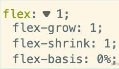

## Html5 和 CSS3


### src 和 href 的区别

src 用于替换当前元素，href 用于在当前文档和引用资源之间确认联系。

- src
  src 是 source 的缩写，指向外部资源的位置，指向的内容将会嵌入到文档中当前标签所在位置，

### 常见的水平垂直居中实现方案

- flex 布局方法

  ```css
  .father {
    display: flex;
    justify-content: center;
    align-items: center;
  }
  .son {
    ...;
  }
  ```

- 绝对定位配合 margin:auto，的实现方案

  ```css
  .father {
    position: relative;
  }
  .son {
    position: absolute;
    top: 0;
    left: 0;
    bottom: 0;
    right: 0;
    margin: auto;
  }
  ```

- 绝对定位配合 transform 实现

  ```css
  .father {
    position: relative;
  }
  .son {
    position: absolute;
    top: 50%;
    left: 50%;
    transform: translate(-50%, -50%);
  }
  ```

### BFC 问题

BFC：块格式上下文，是一块独立的渲染区域，内部元素不会影响外部的元素。

### flex:1; 是哪些属性的缩写，对应的属性代表什么含义

flex:1 分别是<br/> **flex-grow**（设置了对应元素的增长系数）<br/>**flex-shrink**(指定了对应元素的收缩规则，只有在所有元素的默认宽度之和大于容器宽度时才会触发)<br/>**flex-basis**（指定了对应元素在主轴上的大小）



### 隐藏元素的属性有哪些

- display: none;
- visibility: hidden;
- opacity: 0;
