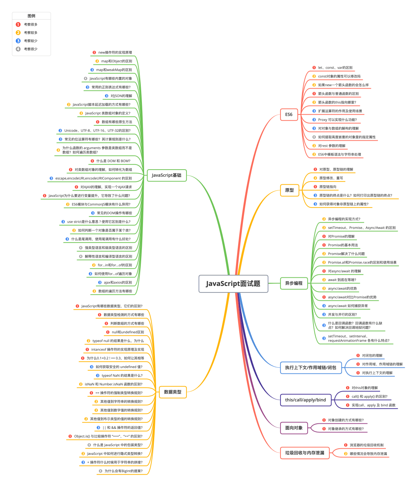

## JavaScript

### JS 的基础类型，typeof 和 instanceof 的区别

    JS 基础类型有：boolean、string、number、bigint、undefined、symbol、null。

typeof 能识别所有的值类型，识别函数，能区分是否是引用类型。<br/>
instanceof 用于检测构造函数的 prototype 属性是否出现在某个实例对象的原型链上。

### 数据类型的检测方式有哪些

- typeof

```jsx
console.log(typeof 2); //number
console.log(typeof true); //boolean
console.log(typeof "str"); //string
console.log(typeof []); //object
console.log(typeof {}); //object
console.log(typeof function () {}); //function
console.log(typeof undefined); //undefined
console.log(typeof null); //object
```

其中，数组、对象和 null 都会判断为 object

- instanceof

`instanceof`可以正确判断对象的类型，**其内部运行机制是判断在其原型链中能否找到该类型的原型。**

```jsx
console.log(2 instanceof Number); //false
console.log(true instanceof Boolean); //false
console.log("str" instanceof String); //false

console.log([] instanceof Array); //true
console.log(function () {} instanceof Function); //true
console.log({} instanceof Object); //true
```

可以看到，`instanceof`只能正确判断引用数据类型，而不能判断基本数据类型。`instanceof`运算符可以用来测试一个对象在其原型链中是否存在一个构造函数的`prototype`属性。

### 数组的 forEach 和 map 方法有哪些区别？常用哪些方法去对数组进行增、删、改

forEach 是对数组的每一个元素执行一次给定的函数。<br/>
map 是创建一个新数组,该新数组由原数组的每个元素都调用一次提供的函数返回的值。

    pop():删除数组后面的最后一个元素,返回值为被删除的那个元素。
    push():将一个元素或多个元素添加到数组末尾，并返回新的长度。
    shift():删除数组中的第一个元素，并返回被删除元素的值。
    unshift():将一个或多个元素添加到数组的开头，并返回该数组的新长度。
    splice():通过删除或替换现有元素或者原地添加新的元素来修改数组，并以数组形式返回被修改的内容。
    reverse(): 反转数组。

### 闭包和作用域

闭包是作用域应用的特殊场景。 js 中常见的作用域包括全局作用域、函数作用域、块级作用域。要知道**js 中自由变量的查找是在函数定义的地方，向上级作用域查找，不是在执行的地方。** 常见的闭包使用有两种场景：一种是函数作为参数被传递；一种是函数作为返回值被返回。

### 实现一个类似关键字 new 功能的函数

```javascript
function newFn(...args) {
  const constructor = args.shift();
  const obj = Object.create(constructor.prototype);
  const result = constructor.apply(obj, args);
  return typeof result === "object" && result !== null ? result : obj;
}

function Person(name) {
  this.name = name;
}

const p = newFn(Person, "Jerome");

console.log("p.name :>> ", p.name); // p.name :>>  Jerome
```

### 箭头函数和普通函数有什么区别

箭头函数不会创建自身的 this，只会从上一级继承 this，箭头函数的 this 在定义的时候就已经确认了，之后不会改变。同时箭头函数无法作为构造函数使用，没有自身的 prototype，也没有 arguments。

### let、var、const 区别是什么

- **重复声明：**var 可以重复声明变量，let 和 const 不可以。
- **块级作用域：**let 和 const 具有块级作用域，var 不存在块级作用域。块级作用域由`{ }`包括，解决了 es5 的两个问题：
  - 内层变量可能覆盖外层变量
  - 用来计数的循环变量泄露为全局变量
- **变量提升：**var 存在变量提升，let 和 const 不存在变量提升。变量提升即变量只能在声明之后使用，否则会报错。
- **暂时性死区：**在使用 let 和 const 声明变量之前，该变量都是不可用的，语法上成为暂时性死区，var 不存在暂时性死区。
- **初始值设置：**声明变量时，var 和 let 不用设置初始值，const 变量必须设置初始值。
- **给全局添加属性：**var 声明的变量是全局变量，并且会将该变量添加为全局对象的属性，let 和 const 不会。
- **指针指向：**let 和 const 都是 es6 新增的语法，let 创建的变量可以改变指针指向（可以重新赋值），但 const 声明的变量不允许改变指针的指向。

### const 声明的值可以修改吗

const 保证的并不是变量的值不能改动，而是变量指向的那个内存地址不能改动，而对于基本类型的数据（数值、字符串、布尔值），它的值就保存在变量指向的内存地址，因此等同于常量。

但如果对于引用数据类型的数据（对象，数组）来说，变量指向数据的内存地址，保存的只是一个指针，const 只能保证这个指针不变，至于它的数据结构是不是可变得，就不能控制了。
