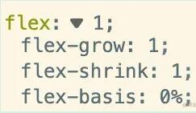

## Html5 和 CSS3

### 常见的水平垂直居中实现方案

- flex 布局方法

  ```css
  .father {
    display: flex;
    justify-content: center;
    align-items: center;
  }
  .son {
    ...;
  }
  ```

- 绝对定位配合 margin:auto，的实现方案

  ```css
  .father {
    position: relative;
  }
  .son {
    position: absolute;
    top: 0;
    left: 0;
    bottom: 0;
    right: 0;
    margin: auto;
  }
  ```

- 绝对定位配合 transform 实现

  ```css
  .father {
    position: relative;
  }
  .son {
    position: absolute;
    top: 50%;
    left: 50%;
    transform: translate(-50%, -50%);
  }
  ```

### BFC 问题

BFC：块格式上下文，是一块独立的渲染区域，内部元素不会影响外部的元素。

### flex:1; 是哪些属性的缩写，对应的属性代表什么含义

flex:1 分别是<br/> **flex-grow**（设置了对应元素的增长系数）<br/>**flex-shrink**(指定了对应元素的收缩规则，只有在所有元素的默认宽度之和大于容器宽度时才会触发)<br/>**flex-basis**（指定了对应元素在主轴上的大小）



### 隐藏元素的属性有哪些

- display: none;
- visibility: hidden;
- opacity: 0;

## JavaScript

### JS 的基础类型，typeof 和 instanceof 的区别

    JS 基础类型有：boolean、string、number、bigint、undefined、symbol、null。

typeof 能识别所有的值类型，识别函数，能区分是否是引用类型。<br/>
instanceof 用于检测构造函数的 prototype 属性是否出现在某个实例对象的原型链上。

### 数组的 forEach 和 map 方法有哪些区别？常用哪些方法去对数组进行增、删、改

forEach 是对数组的每一个元素执行一次给定的函数。<br/>
map 是创建一个新数组,该新数组由原数组的每个元素都调用一次提供的函数返回的值。

    pop():删除数组后面的最后一个元素,返回值为被删除的那个元素。
    push():将一个元素或多个元素添加到数组末尾，并返回新的长度。
    shift():删除数组中的第一个元素，并返回被删除元素的值。
    unshift():将一个或多个元素添加到数组的开头，并返回该数组的新长度。
    splice():通过删除或替换现有元素或者原地添加新的元素来修改数组，并以数组形式返回被修改的内容。
    reverse(): 反转数组。

### 闭包和作用域

闭包是作用域应用的特殊场景。 js 中常见的作用域包括全局作用域、函数作用域、块级作用域。要知道**js 中自由变量的查找是在函数定义的地方，向上级作用域查找，不是在执行的地方。** 常见的闭包使用有两种场景：一种是函数作为参数被传递；一种是函数作为返回值被返回。

### 实现一个类似关键字 new 功能的函数

```javascript
function newFn(...args) {
  const constructor = args.shift();
  const obj = Object.create(constructor.prototype);
  const result = constructor.apply(obj, args);
  return typeof result === "object" && result !== null ? result : obj;
}

function Person(name) {
  this.name = name;
}

const p = newFn(Person, "Jerome");

console.log("p.name :>> ", p.name); // p.name :>>  Jerome
```

### 箭头函数和普通函数有什么区别

箭头函数不会创建自身的 this，只会从上一级继承 this，箭头函数的 this 在定义的时候就已经确认了，之后不会改变。同时箭头函数无法作为构造函数使用，没有自身的 prototype，也没有 arguments。

## React

```

```
