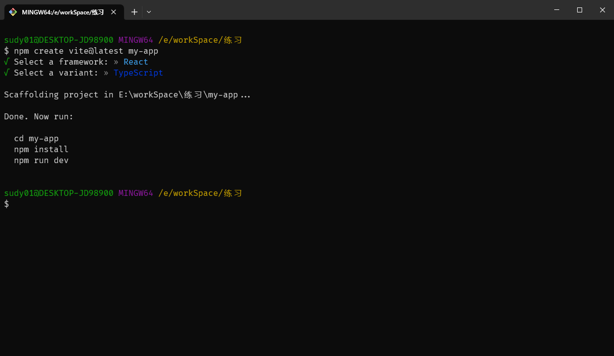

## create-react-app

使用 create-react-app 官方脚手架创建 React 应用

全局安装

```bash
npm install -g create-react-app

create-react-app my-app
cd my-app
npm start
```

或

```bash
npx create-react-app my-app
cd my-app
npm start
```

## umijs

先找个地方建个空目录。

```bash
mkdir myapp && cd myapp
```

通过官方工具创建项目

```bash
yarn create @umijs/umi-app
# 或 npx @umijs/create-umi-app

yarn
yarn start
```

## vite

```bash
npm create vite@latest my-app
```

根据选项选择即可


