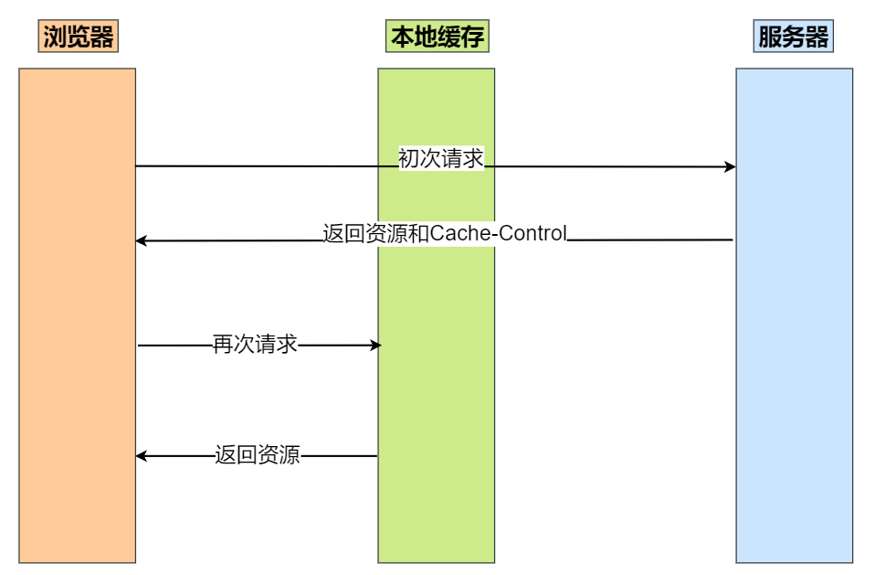
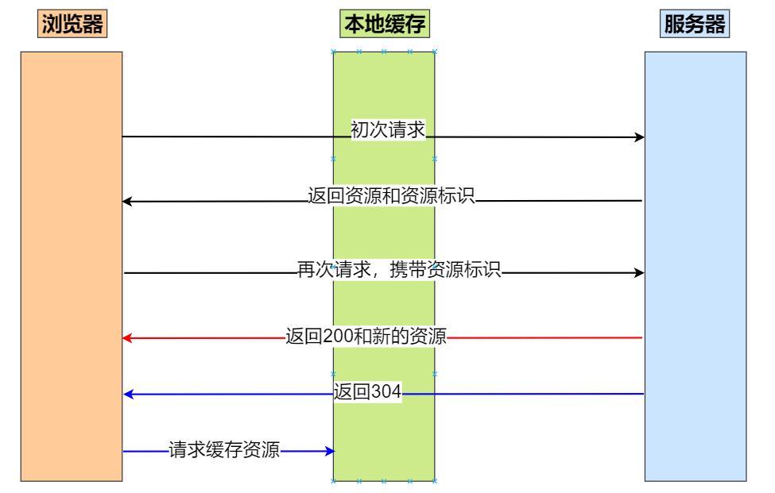
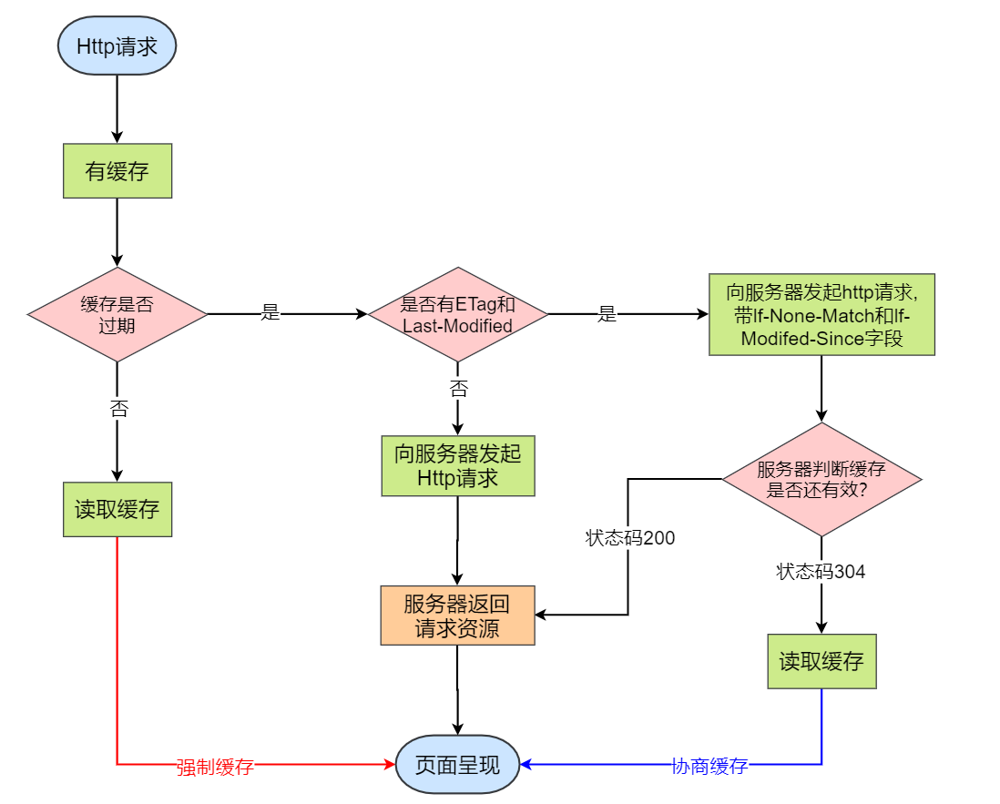

## 什么是缓存？

缓存是一种保存资源副本并在下次请求时直接使用该副本的技术。

使用缓存是前端性能优化的重要方式，既可以提高响应的速度又可以减少不必要的重复请求，从而提高服务器的吞吐量。但是有时候缓存并不适用于所有情况，有时候反而会使用户体验变差，因此需要根据不同的请求制定不同的缓存策略。

## 什么是浏览器缓存？

浏览器缓存就是浏览器把一个已经请求过的 Web 资源拷贝一份副本储存在本地磁盘中。当再次访问相同的 URL 时，浏览器会根据缓存机制决定是直接使用副本响应访问请求，还是向服务器再次发送请求

## HTTP 协议的缓存策略有两种

[此篇文章我觉得也不错！~](https://juejin.cn/post/6961227394396979230)

分别是强制缓存和协商缓存

> **注意：强制缓存的优先级大于协商缓存**

---

**强制缓存**是服务器告诉浏览器一个缓存时间，在缓存时间内，下次请求，直接用缓存，不在时间内，执行协商缓存策略。

> **一句话：强制缓存就是文件直接从本地缓存中获取，不需要再发送请求获取资源。**

从上图可以看到，当初次请求时，浏览器会向服务器发起请求，服务器接收到浏览器的请求后，返回资源并返回一个 Cache-Control 给客户端，该 Cache-Control 一般设置缓存的最大过期时间。

此时浏览器已经接收到 cache-control 的值，那么这个时候浏览器再次发送请求时，它会先检查它的 cache-control 是否过期，如果没有过期则直接从本地缓存中拉取资源，返回到客户端，而无需再经过服务器。

强制缓存有过期时间，那么就意味着总有一天缓存会失效。那么假设某一天，客户端的 cache-control 失效了，那么它就没办法从本地缓存中拉取资源。
于是它会重新向服务器发起请求，之后服务器会再次返回资源和 cache-control 的值。

---

**协商缓存**是一种服务端的缓存策略，即通过服务端来判断某件事情是不是可以被缓存。

协商缓存是让客户端与服务器之间能实现缓存文件是否更新的验证、提升缓存的复用率，将缓存信息中的 Etag 和 Last-Modified 字段通过请求发送给服务器，由服务器校验。如果资源一致则返回 304 并继续使用浏览器缓存，反之返回 200 和最新的资源。

协商缓存：让客户端与服务器之间能实现缓存文件是否更新的验证、提升缓存的复用率，将缓存信息中的 Etag 和 Last-Modified 通过请求发送给服务器，由服务器校验。如果文件没有改变，那么直接返回 304 状态，继续使用浏览器缓存。

HTTP 缓存都是从第二次请求开始的：

第一次请求资源时，服务器返回资源，并在响应头首部中回传资源的缓存策略。
第二次请求时，浏览器判断这些请求参数，击中强缓存就直接返回状态码 200，否则就把请求参数加到请求头首部中传给服务器，看是否击中协商缓存，击中则返回 304，否则服务器会返回新的资源。

## 怎么实现的？缓存协商流程图

### 刷新缓存

我们平时对请求的不同处理对缓存的影响是不一样的，使用的缓存策略也是不同的，通常：

第一次请求一般都是强制缓存有效
当是更新整个页面的操作的时候，是协商缓存有效

### 正常请求操作

定义： 地址栏输入 url 或者 跳转链接 或者 前进后退等。
对缓存的影响： 强制缓存有效，协商缓存有效。

### 手动刷新

定义： F5 或者 点击刷新按钮 或者 右击菜单刷新。
对缓存的影响： 强制缓存失效，协商缓存有效。

### 强制刷新

定义： ctrl + F5 。
对缓存的影响： 强制缓存失效，协商缓存失效。
